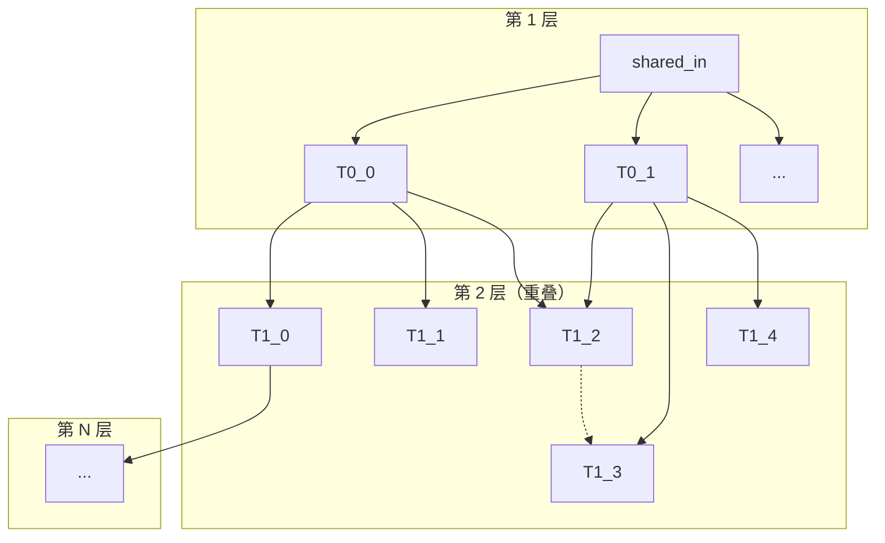
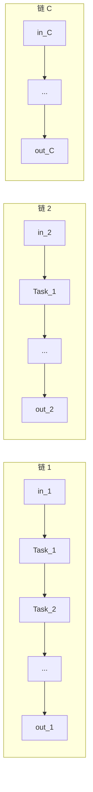

# AICPU UT 性能样例说明

本目录包含所有性能测试用例（perf cases）的源码。样例文件名以 `test_` 开头、去掉结尾的 `case`，其余部分不变（如 `linear_case.cpp` → `test_linear.cpp`，`alternating_matmul_add.cpp` → `test_alternating_matmul_add.cpp`）。由测试驱动在编译时通过 `PERF_BACKEND` 与 `PERF_CASE_IDX` 选择并包含，**不要单独编译**。

运行方式见上层目录的 `run_tests.sh`，例如：

```bash
./run_tests.sh --profiling                    # 默认跑所有 perf 用例（各取 idx 0）
./run_tests.sh --test test_linear --idx 1     # 指定用例与参数下标
./run_tests.sh --test test_throughput --orch  # 仅编排模式
./run_tests.sh --list                         # 列出所有用例
```

---

## 1. test_linear.cpp（线性链）

| 项目 | 说明 |
|------|------|
| **PERF_BACKEND** | 0 |
| **脚本名** | test_linear |
| **用途** | 线性依赖链：任务 1 → 2 → … → L，测链长与 tensor 规模对编排/调度的影响。 |
| **图结构** | 链长 L，每节点 1 个 element-wise 任务（VECTOR），前驱输出作为后继输入。首节点读外部 input，末节点写外部 output。 |
| **Kernel** | FUNC_ELEMENT_WISE，PTO2_WORKER_VECTOR。 |
| **参数** | `chain_length`：链上任务数；`tensor_nelems`：每 tensor 元素数（float）。 |
| **Case 数** | 3（PERF_CASE_IDX 0/1/2） |

### 参数表

| PERF_CASE_IDX | 名称 | chain_length | tensor_nelems |
|---------------|------|--------------|---------------|
| 0 | Linear-64   (chain=64,   tensor=1024 floats)   | 64   | 1024  |
| 1 | Linear-1024 (chain=1024, tensor=1024 floats)   | 1024 | 1024  |
| 2 | Linear-256  (chain=256,  tensor=16384 floats)  | 256  | 16384 |

---

## 2. test_throughput.cpp（分层 DAG 吞吐）

| 项目 | 说明 |
|------|------|
| **PERF_BACKEND** | 7 |
| **脚本名** | test_throughput |
| **用途** | 分层 DAG：第 1 层无依赖可同时就绪，第 2 层依赖第 1 层且层内任务有重叠，第 N 层依赖第 N-1 层；用于测调度/编排在可控依赖与重叠下的表现。 |
| **图结构** | n 层：第 1 层 layer0_size 个任务读共享输入；第 k 层（k≥2）每任务依赖上一层若干前驱，上一层每任务在本层有 D 个依赖者，相邻组重叠 O 个。层大小：size[0]=layer0_size，size[k]=D+(size[k-1]-1)*(D-O)。 |
| **Kernel** | FUNC_ELEMENT_WISE，PTO2_WORKER_VECTOR。 |
| **参数** | `num_layers`（层数 n）、`layer0_size`（第一层任务数）、`deps_per_task`（依赖数 D）、`overlap`（重叠数 O）、`worker_mode`（worker 分配策略：0=全 AIV，1=奇数 AIC/偶数 AIV，2=每层前半 AIC/后半 AIV）。n/layer0/D/O 由宏 AICPU_UT_THROUGHPUT_* 或 run_tests.sh 传入，默认 n=10、layer0=320、D=6、O=5。 |
| **Case 数** | 3（PERF_CASE_IDX 0/1/2） |
| **run_tests.sh 可控参数** | `--layer-num n`、`--layer0-task-num W`、`--dependency D`、`--overlap O`（默认 n=10、layer0=320、D=6、O=5）。环境变量：AICPU_UT_THROUGHPUT_LAYERS / LAYER0_SIZE / DEPS / OVERLAP。 |

### 参数表

| PERF_CASE_IDX | 名称 | num_layers | layer0_size | deps_per_task | overlap | worker_mode |
|---------------|------|------------|-------------|---------------|---------|-------------|
| 0 | ThroughputLayers all-AIV (n=10, layer0=320, D=6, O=5) | 10 | 320 | 6 | 5 | 0（全 AIV） |
| 1 | ThroughputLayers odd-AIC/even-AIV (n=10, layer0=320, D=6, O=5) | 10 | 320 | 6 | 5 | 1（奇 AIC 偶 AIV） |
| 2 | ThroughputLayers half-AIC/half-AIV per layer (n=10, layer0=320, D=6, O=5) | 10 | 320 | 6 | 5 | 2（每层前半 AIC 后半 AIV） |

### 依赖图形状（test_throughput）

第 1 层无依赖；第 2 层起每任务依赖上一层若干前驱，层内任务有重叠（上一层的“依赖数”与“重叠数”由参数决定）：



- **第 1 层**：layer0_size 个任务，无依赖，读共享输入，输出为 make_tensor。
- **第 2～N 层**：层 k 任务 j 依赖层 k-1 中满足 i*(D-O) ≤ j < i*(D-O)+D 的任务 i；D=依赖数，O=重叠数。

---

## 3. test_latency.cpp（极限延迟 / 多链线性）

| 项目 | 说明 |
|------|------|
| **PERF_BACKEND** | 8 |
| **脚本名** | test_latency |
| **用途** | 多条独立线性链 task1→task2→…→taskL，可配置**链的数量**与**链长**，用于测延迟/吞吐。Case 0：链上任务均为 AIV；Case 1：链上任务 AIC/AIV 交替。 |
| **图结构** | num_chains 条链，每条链长 chain_length：input_c → Task_1 → … → Task_L → output_c；链之间无依赖。 |
| **Kernel** | FUNC_ELEMENT_WISE，PTO2_WORKER_VECTOR（Case 0）或 CUBE/VECTOR 交替（Case 1）。 |
| **参数** | `num_chains`：链的数量；`chain_length`：每条链上的任务数。由宏 AICPU_UT_LATENCY_NUM_CHAINS、AICPU_UT_LATENCY_CHAIN_LENGTH 在编译期传入（默认 64、64），或由 run_tests.sh 通过 CMake 覆盖。 |
| **Case 数** | 2（PERF_CASE_IDX 0/1） |
| **run_tests.sh 可控参数** | `--chain-num N`、`--chain-length L`；环境变量对应 AICPU_UT_LATENCY_NUM_CHAINS、AICPU_UT_LATENCY_CHAIN_LENGTH（编译期写入二进制）。 |

### 参数表

| PERF_CASE_IDX | 名称 | num_chains | chain_length |
|---------------|------|------------|--------------|
| 0 | Latency all-AIV (chains=64, len=64) | 由宏/CMake 决定（默认 64） | 由宏/CMake 决定（默认 64） |
| 1 | Latency aic/aiv alternate (chains=64, len=64) | 由宏/CMake 决定（默认 64） | 由宏/CMake 决定（默认 64） |

### 依赖图形状（test_latency）

每条链为 **task1 → task2 → … → taskN** 的线性依赖，多条链并行、链间无依赖：



- **节点**：每条链 1 个外部输入 + chain_length 个任务 + 1 个外部输出；中间任务用 make_tensor 的中间张量连接。
- **边**：链内顺序依赖；链与链之间无边。

---

## 4. test_deg2.cpp / test_deg4.cpp / test_deg8.cpp（分层 DAG，不同度数）

| 项目 | 说明 |
|------|------|
| **PERF_BACKEND** | 3（与 PERF_CASE_IDX 共同决定用 deg2/deg4/deg8） |
| **脚本名** | test_deg_2 / test_deg_4 / test_deg_8 |
| **用途** | 分层 DAG，每层宽度 W×num_sched（EW），层数 L，每任务依赖前一层 D 个前驱（循环偏移），用于测**不同平均度数**下 fanout/fanin 与 Complete 阶段开销。 |
| **图结构** | 第 0 层：EW 个任务读共享外部输入；第 i 层（i≥1）：EW 个任务，任务 j 依赖第 i-1 层的 `(j+d) % EW`（d=0..D-1）。总任务数 = EW×L，DepList 条目数 ≈ (L-1)×EW×D，需小于 DepListPool 容量（65536）。 |
| **Kernel** | FUNC_ELEMENT_WISE，PTO2_WORKER_VECTOR。 |
| **参数** | W：每线程层宽；L：层数；fanout(D)：每任务前驱数；tensor_nelems：中间 tensor 元素数。有效层宽 EW = W × num_sched_threads。 |

### test_deg2（平均度数 ≈2）

| PERF_CASE_IDX | 名称 | W | L | fanout | 总任务数(EW×L) | tensor_nelems |
|---------------|------|---|---|--------|----------------|---------------|
| 0 | Degree-2 (W=64,  L=64,  fanout=2, tasks=4096) | 64  | 64  | 2 | 12288* | 64 |

\* 代码中 name 的 tasks=4096 为 W×L；实际运行总任务数 = EW×L，EW=W×num_sched=64×3=192，即 192×64=12288。

### test_deg4（平均度数 ≈4）

| PERF_CASE_IDX | 名称 | W | L | fanout | 总任务数(EW×L) | tensor_nelems |
|---------------|------|---|---|--------|----------------|---------------|
| 0 | Degree-4 (W=32,  L=128, fanout=4, tasks=4096) | 32  | 128 | 4 | 96×128=12288* | 64 |

### test_deg8（平均度数 ≈8）

| PERF_CASE_IDX | 名称 | W | L | fanout | 总任务数(EW×L) | tensor_nelems |
|---------------|------|---|---|--------|----------------|---------------|
| 0 | Degree-8 (W=16,  L=128, fanout=8, tasks=2048) | 16  | 128 | 8 | 48×128=6144* | 64 |

\* 总任务数 = EW×L（EW=W×num_sched）。deg8 的 L=128 用于控制 DepList 条目数 (L-1)×EW×8 < 65536。

---

## 5. test_alternating_matmul_add.cpp（交替 Matmul+Add）

| 项目 | 说明 |
|------|------|
| **PERF_BACKEND** | 4 |
| **脚本名** | test_alt |
| **用途** | 混合 CUBE（Matmul）与 VECTOR（Add）任务，**无依赖**，测多算子类型下的编排与调度。 |
| **图结构** | 单 scope 内交替提交 matmul 组与 add 组，组内任务独立；无边。 |
| **Kernel** | FUNC_MATMUL（CUBE）、FUNC_ADD（VECTOR）；每 matmul 128×128，每 add 128×128。 |
| **参数** | batch, M, N, matmul_batch, add_batch；matmul 组数 = batch×M/matmul_batch，add 组数 = batch×N/add_batch。 |
| **Case 数** | 2（PERF_CASE_IDX 0/1） |

### 参数表

| PERF_CASE_IDX | 名称 | batch | M | N | matmul_batch | add_batch | 总任务数 |
|---------------|------|-------|---|---|--------------|-----------|----------|
| 0 | Alternating (batch=500, M=4, N=4, mb=4, ab=4) | 500 | 4 | 4 | 4 | 4 | 1000 |
| 1 | Alternating (batch=512, M=2, N=5, mb=4, ab=5) | 512 | 2 | 5 | 4 | 5 | 768  |

---

## 6. test_benchmark_bgemm.cpp（Batched GEMM）

| 项目 | 说明 |
|------|------|
| **PERF_BACKEND** | 5 |
| **脚本名** | test_bgemm |
| **用途** | 分块 GEMM + TILE_ADD 的依赖图：每组内 CUBE（GEMM_TILE）与 VECTOR（TILE_ADD）成对，通过中间 partial-sum 张量 P 形成依赖。 |
| **图结构** | 每组有 grid_k 个 GEMM_TILE 任务，其输出经 TILE_ADD 累加；组内 GEMM→ADD 有依赖，组间无依赖。 |
| **Kernel** | FUNC_GEMM_TILE（CUBE）、FUNC_TILE_ADD（VECTOR）。 |
| **参数** | tile_size, grid_k, num_groups, incore_loop；任务数 = num_groups × grid_k × 2（gemm + add 各一批）。 |
| **Case 数** | 5（PERF_CASE_IDX 0..4） |

### 参数表

| PERF_CASE_IDX | 名称 | tile_size | grid_k | num_groups | incore_loop | 总任务数 |
|---------------|------|-----------|--------|------------|-------------|----------|
| 0 | BGEMM Case0 (task_num=500, tile=128, incore_loop=4,  grid_k=2) | 128 | 2 | 250 | 4  | 1000 |
| 1 | BGEMM Case1 (task_num=64,  tile=128, incore_loop=4,  grid_k=2) | 128 | 2 |  32 | 4  | 128  |
| 2 | BGEMM Case2 (task_num=256, tile=128, incore_loop=4,  grid_k=2) | 128 | 2 | 128 | 4  | 512  |
| 3 | BGEMM Case3 (task_num=64,  tile=128, incore_loop=16, grid_k=2) | 128 | 2 |  32 | 16 | 128  |
| 4 | BGEMM Case4 (task_num=64,  tile=128, incore_loop=4,  grid_k=4) | 128 | 4 |  16 | 4  | 128  |

---

## 7. test_paged_attention.cpp（单条 Paged Attention）

| 项目 | 说明 |
|------|------|
| **PERF_BACKEND** | 1 |
| **脚本名** | test_paged_attention |
| **用途** | 单条 Paged Attention 流程的小规模配置，用于功能与流程验证。 |
| **图结构** | 按 chunk 组织 QK、Softmax、PV、Online Update 等 CUBE/VECTOR 任务，存在 chunk 内依赖。 |
| **Kernel** | QK_MATMUL、SOFTMAX_PREPARE、PV_MATMUL、ONLINE_UPDATE、AIC_HUB、AIV_HUB。 |
| **Case 数** | 1（PERF_CASE_IDX 0） |

### 参数表

| PERF_CASE_IDX | 名称 | 说明 |
|---------------|------|------|
| 0 | Paged Attention Basic | batch=2, num_heads=4, kv_head_num=1, head_dim=8, block_size=4, block_num=2, context_lens=[8,8] |

---

## 8. test_batch_paged_attention.cpp（批量 Paged Attention）

| 项目 | 说明 |
|------|------|
| **PERF_BACKEND** | 2 |
| **脚本名** | test_batch_paged_attention |
| **用途** | 批量、变长 context 的 Paged Attention，接近真实推理负载。 |
| **图结构** | 与 paged_attention 类似，按 batch 与 context_len 分 chunk，每 chunk 内 QK/Softmax/PV/Update 等，CUBE 与 VECTOR 混合，fanout 可能较大（如 max_degree=65）。 |
| **Kernel** | 同 paged_attention。 |
| **Case 数** | 3（PERF_CASE_IDX 0/1/2） |

### 参数表

| PERF_CASE_IDX | 名称 | 说明 |
|---------------|------|------|
| 0 | Case1 (batch=64, num_heads=16, head_dim=128, block_size=128, context_len=8193) | batch=64, num_heads=16, head_dim=128, block_size=128, block_num=256, context_len=8193 |
| 1 | CaseVarSeq2 (batch=2, context_lens=[8192,4096]) | batch=2, context_lens=[8192, 4096] |
| 2 | CaseVarSeq4 (batch=4, context_lens=[8192,4096,1024,256]) | batch=4, context_lens=[8192, 4096, 1024, 256] |

---

## 9. test_paged_attention_unroll.cpp（Paged Attention Unroll）

| 项目 | 说明 |
|------|------|
| **PERF_BACKEND** | 6 |
| **脚本名** | test_pau |
| **用途** | 将 N_UNROLL=8 个 KV block 融合为一组任务，减少任务数，测融合后的编排/调度与 CUBE/VECTOR 混合。 |
| **图结构** | 每 (b_idx, q_idx) 一个 scope：AIV_HUB → 多组 (QK_MATMUL → SOFTMAX → PV_MATMUL → ONLINE_UPDATE)，组数 G = ceil(bn_this_batch / N_UNROLL)。 |
| **Kernel** | 同 paged_attention，但每组覆盖 N_UNROLL 个 block。 |
| **Case 数** | 3（PERF_CASE_IDX 0/1/2） |

### 参数表

| PERF_CASE_IDX | 名称 | 说明 |
|---------------|------|------|
| 0 | PAUnroll-0 | batch=2, heads=16, dim=128, bs=128, bn=256, ctx=8192 |
| 1 | PAUnroll-1 | batch=2, heads=64, dim=128, bs=128, bn=256, ctx=8192 |
| 2 | PAUnroll-2 | batch=2, heads=64, dim=256, bs=64, bn=512, ctx=8192 |

---

## 运行模式与二进制对应关系

每个用例可编译为三种驱动之一，对应不同运行模式：

| 模式 | 脚本后缀 | 含义 |
|------|----------|------|
| concurrent | test_*_concurrent_&lt;idx&gt; | 编排线程与调度线程并发，完整流程 + 调度 profiling |
| orch_only  | test_*_orch_only_&lt;idx&gt;  | 仅跑编排，不启动调度线程，测编排耗时与提交吞吐 |
| sched_prof_only | test_*_sched_prof_only_&lt;idx&gt; | 先跑编排再跑调度，仅对调度阶段做 profiling |

通过 `run_tests.sh` 的 `--orch`、`--sched` 选择 orch_only 或 sched_prof_only；不加则默认 concurrent。

---

## 环境变量（可选）

| 变量 | 说明 |
|------|------|
| AICPU_UT_NUM_SCHED_THREADS | 调度线程数（默认 3）。degree 类用例的 EW = W × 该值。 |
| PERF_WAIT_AFTER_INIT | 设置后，编排完成后 SIGSTOP，便于挂 perf 再 SIGCONT 继续。 |
| AICPU_UT_NO_CHECK | 置 1 关闭 P1/P2 调度一致性检查。 |
